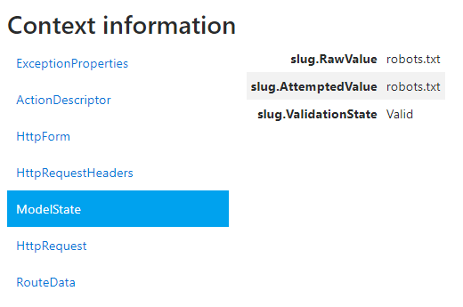

Creating a custom context provider
==================================

Context providers are used to automatically attach information to each error report. The information is useful to determine why an exception have been thrown.



To create a provider you need to create a class which implements the context provider interface. In the .NET standard library the interface is named `IContextCollectionProvider` and in .NET (4.x) it's named `IContextInfoProvider`.

## .NET Standard example

Here is a sample for .NET Core MVC:

```csharp
public class ViewBagProvider : IContextCollectionProvider
{
    /// <inheritdoc />
    public ContextCollectionDTO Collect(IErrorReporterContext context)
    {
        if (!(context is MvcCoreErrorContext aspNetContext) || aspNetContext.ViewBag == null)
            return null;

        var converter = new ObjectToContextCollectionConverter();
        return converter.Convert(Name, aspNetContext.ViewBag);
    }

    /// <inheritdoc />
    public string Name => "ViewBag";
}
```

## .NET 4.x example

Here is an example from ASP.NET MVC5:

```csharp
public class ViewBagProvider : IContextInfoProvider
{
    /// <inheritdoc />
    public ContextCollectionDTO Collect(IErrorReporterContext context)
    {
        var aspNetContext = context as AspNetMvcContext;
        if (aspNetContext?.ViewBag == null)
            return null;

        var converter = new ObjectToContextCollectionConverter();
        var collection = converter.Convert(Name, aspNetContext.ViewBag);

        //not beatiful, but we do not want to reflect the object twice
        return collection.Properties.Count == 0 ? null : collection;
    }

    /// <summary>ViewBag</summary>
    public string Name => "ViewBag";
}
```

## Getting information from the .NET library

In most cases you need to be able to get information from your favorite .NET framework/library. For that Coderr provides a context that you can use to extract information.

The context is different for each Coderr client library. Here is a list of all available contexts:

Client name | URL
----------- | ---------
Base library | [Github link](https://github.com/coderrapp/codeRR.Client/blob/master/src/Coderr.Client/Reporters/ErrorReporterContext.cs)
ASPNET | [Github link](https://github.com/coderrapp/codeRR.Client.AspNet/blob/master/src/Coderr.Client.AspNet/HttpErrorReporterContext.cs)
ASPNET MVC5 | [Github link](https://github.com/coderrapp/codeRR.Client.AspNet.Mvc5/blob/master/src/Coderr.Client.AspNet.Mvc5/AspNetMvcContext.cs)
WPF | [Github link](https://github.com/coderrapp/codeRR.Client.WPF/blob/master/src/Coderr.Client.Wpf/WpfErrorReporter.cs)
WinForms | [Github link](https://github.com/coderrapp/codeRR.Client.WinForms/blob/master/src/Coderr.Client.WinForms/WinformsErrorReportContext.cs)
