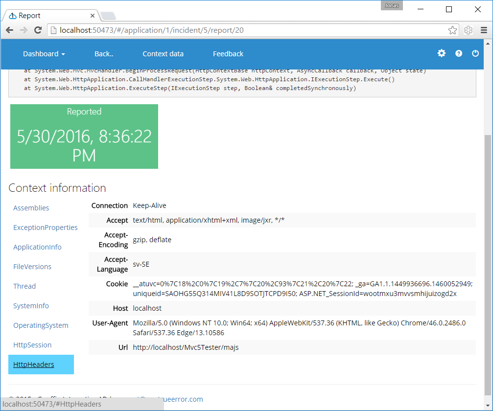

Context information provider
===============================

Context information providers are used to provide additional information about the application state when an exception is thrown. A trivial example is to provide information about the HTTP request in web applications.

A custom provider is created by implementing the `IContextInfoProvider` interface.

Example from the ASP.NET MVC5 extension library:

```csharp
public class HttpHeadersProvider : IContextInfoProvider
{
	public ContextCollectionDTO Collect(IErrorReporterContext context)
	{
		var myHeaders = new NameValueCollection(HttpContext.Current.Request.Headers);
		myHeaders["Url"] = HttpContext.Current.Request.Url.ToString();
		return new ContextCollectionDTO("HttpHeaders", myHeaders);
	}

	public string Name
	{
		get { return "HttpHeaders"; }
	}
}

```

The name property specifies what the collection will be shown as in the user interface. The above collector generates the following information:




# Conventions

A couple of conventions which can be used within your collector.

## Exceptions during collection

A context info provider MUST not throw exceptions. Therefore you need to have a catch all which wraps your logic. You can however include the exception within your context collection to be able to analyze the exception in our UI.

```csharp
var properties = new Dictionary<string,string>();
try
{
	properties["CurrentUser"] = Thread.CurrentPrincipal.Identity.Name;
}
catch (Exception ex)
{
    properties["CurrentUser.Error"] = ex.ToString();
}
return new ContectInfoCollection("YourCollectionName", properties);
```

## Adding tags

You can add tags to error reports by using a context collection property named `OneTrueTags`:

```csharp
var properties = new Dictionary<string,string>();
try
{
	properties["CurrentUser"] = Thread.CurrentPrincipal.Identity.Name;
}
catch (Exception ex)
{
    properties["CurrentUser.Error"] = ex.ToString();
}

//add tag:
property["OneTrueTags"] = "fatal";

return new ContectInfoCollection("YourCollectionName", properties);
```


