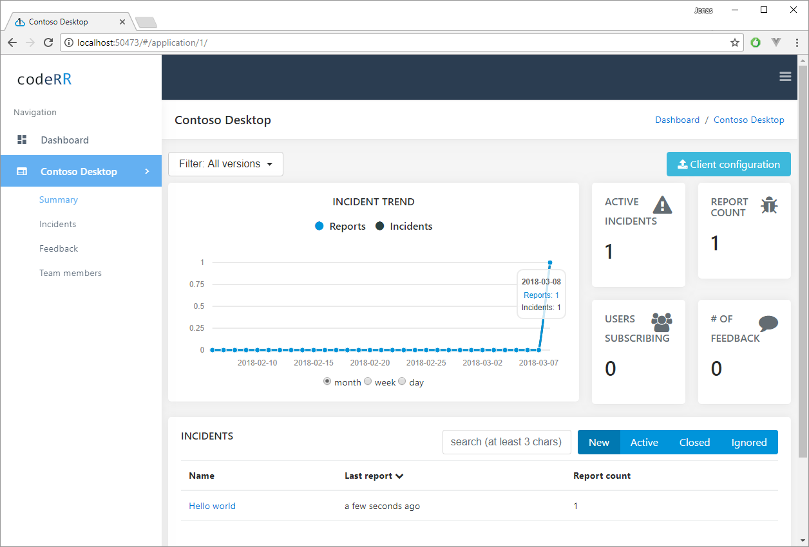

Getting started
================

# Prerequisites

This guide assumes that you have installed and configured one of our [nuget](https://www.nuget.org/packages?q=coderr.client) libraries.

You have also created an account at our hosted service [codeRR Live](https://app.coderr.io) or in your installed instance of [codeRR Community Server](../server/installation.md).

## Simplest possible reporting

The `Err` class in the client library is the main API for codeRR. 

At its simplest form you report errors using the `Err.Report(exception)` method.

```csharp
try
{
    somelogic();
}
catch(SomeException ex)
{
	Err.Report(ex);
}
```

The exception should appear in your server instance shortly after being reported.



## Attaching context information

An exception, by itself, do not convey a story. A typical example is when you try to access a non-existent key in a `Dictionary<TKey, TValue>`:

> 'The given key was not present in the dictionary.'


When you have activated the automated handling of unhandled exceptions you will get relevant context information out of the box. However, when you have your own try/catch block, it makes sense to attach relevant context information.

You can do that by using a second parameter:

```csharp
try
{
    //some stuff that generates an exception
}
catch (Exception ex)
{
    Err.Report(ex, yourContextData);
}
```

### Using anonymous object

If you need to attach multiple values you can use an anonymous object:

```csharp
try
{
    //some stuff that generates an exception
}
catch (Exception ex)
{
    Err.Report(ex, new { UserId = userId, UserState = state });
}
```

**Result**


Complex objects are supported.

### Custom collections

We also have an object overload which can transform any object into a context collection (one of the groups in the "Context Data" menu in the codeRR website).

Below we are using `ToContextCollection()` extension method which can transform any object (including complex objects) into a context collection.


```csharp
try
{
    //some stuff that generates an exception
}
catch (Exception ex)
{
    var modelCollection = viewModel.ToContextCollection("ViewModel");
    var loggedInUser = User.ToContextCollection("User");
    Err.Report(ex, new[]{modelCollection, loggedInUser});
}
```

**Result**


Hence you can easily attach and group your information just as you like.

## Categorize exceptions using tags

We automatically identify common StackOverflow.com tags when analyzing exceptions (to help you find answers by searching StackOverflow.com). 

You can
also add your own tags by adding a special property to any context collection named "ErrTags":

```csharp
try
{
    //some stuff that generates an exception
}
catch (Exception ex)
{
    Err.Report(ex, new { ErrTags = "important,backend" });

    // alternative:
    // Err.Report(ex, new { ErrTags = new[]{"important","backend"} });
}
```

**Result:**


# Before going to production

Disable the client libraries ability to throw exceptions when something is wrong. That option is only valuable when you are configuring/learning codeRR.

```csharp
Err.Configuration.ThrowExceptions = false;
```

## Controlling report uploads

By default, reports are thrown away if the upload fails. 

To enable the internal memory queue, activate it:

```csharp
Err.Configuration.QueueReports = true;
```

If you want to control queue size (default is 10 reports) or the number of upload attempts (default is 3 per report) you need to configure codeRR like this:

```csharp
// Initialization
var uri = new Uri("https://report.coderr.io/");

var uploader = new UploadToCoderr(uri, "yourOwnAppKey", "yourOwnSharedSecret");

// Max number of reports that can be queued.
uploader.MaxQueueSize = 10;

//number of attempts per report
uploader.MaxAttempts = 1;

Err.Configuration.Uploaders.Register(uploader);
```

## Adding your own automated context providers

You probably have system specific information that you always want to include when errors are reported. For instance `tenantId`,  `customerId`, logged in user or any other information.

Here is a sample:

```csharp
// Logged in user in ASP.NET web applications
public class LoggedInUserProvider : IContextInfoProvider
{
    public string Name => "CurrentUser";

    public ContextCollectionDTO Collect(IErrorReporterContext context)
    {
        // Each client library implments it's own context
        // to expose framework information
        var ctx = context as AspNetContext;
        if (ctx?.HttpContext == null)
            return null;

        var data = new Dictionary<string, string>
        {
            {"UserName", ctx.HttpContext.User.Identity.Name},
            {"AuthenticationType", ctx.HttpContext.User.Identity.AuthenticationType}
        };
        return new ContextCollectionDTO(Name, data);
    }
}

```

# More information

Each nuget library has its own unique features. You can find the documentation for each one in the [client start page](index.md).
