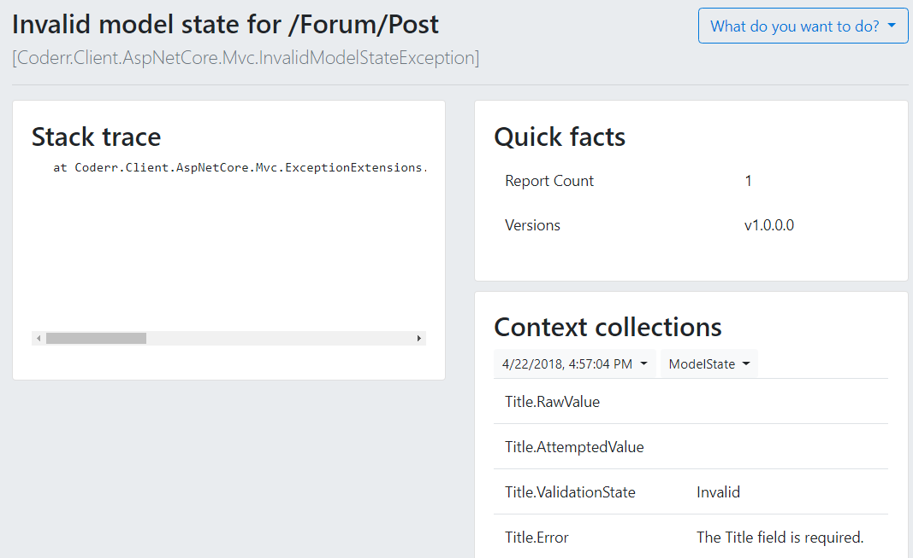
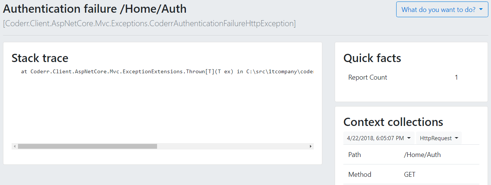
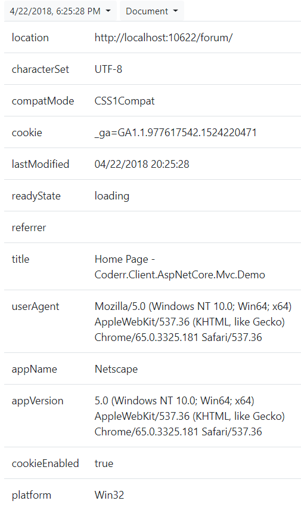
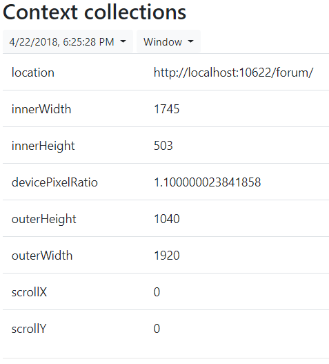
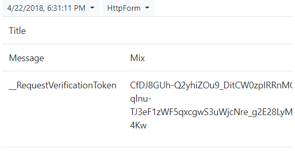
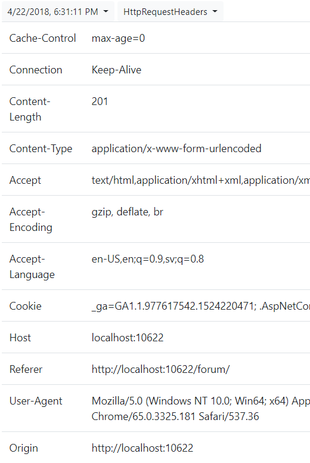

ASP.NET Core MVC
================

Our ASP.NET Core MVC integration will of course report all unhandled ASP.NET and MVC exceptions. But it can also report if something goes too slow or if there are too many authentication failures.

If you need help installing the nuget package, read our [installation guide](./install/).


# Configuration options

These are the additional configuration options that you can activate in Coderr.

## Track invalid model states

When activated, Coderr will report all invalid model states.

Are your user interface as good as you think? Invalid model states give you a clear indication to if it is. If many of your users fail to submit your forms properly it clearly indicates that they either don't know what they should enter, or than your forms have too many fields.

To activate it, simply add:

```csharp
Err.Configuration.TrackInvalidModelStates();
```

Once done you will get one incident per invalid form.



The collection itself contains the fields that failed:


## Track slow requests

Slow requests lower the overall user experience. Coderr allows you to set a threshold regarding how long a request may take.

It's great if you do not want to do performance monitoring but still want to make sure that your application is responsive enough.

To activate the feature, add the following line:

```csharp
var maxTime = TimeSpan.FromMilliseconds(500);
Err.Configuration.TrackSlowRequests(maxTime);
```


## Track authentication failures

Are you interested in all failed authentication attempts? If activated, this feature will report all requests with the `Authorization` header if it get a 401 as a response. [Learn more about HTTP authentication](https://developer.mozilla.org/en-US/docs/Web/HTTP/Authentication).

Activate this feature by using:

```
Err.Configuration.TrackAuthenticationFailures();
```

Example incident:




## Report javascript errors

This library can report javascript errors.

To activate the feature simply include our built in script in your `_Layout.cshtml`:

```html
<script src="/coderr/js/"></script>
```

Once done, all unhandled javascript errors will be reported to Coderr.


### Javascript context collections

The following collections are included for Javascript errors.






## Context collections

These collections are included for all ASP.NET Core MVC exceptions.

To learn more about the included ASP.NET specific context collections like HTTP Request, [read here](../aspnet/index.md)


### ActionDescriptor

Information about the action and why it was selected.


### Form

Information supplied in the HTTP post.



### HttpRequest

Properties from the `HttpRequest` object in MVC.


### HttpRequestHeaders

ALL headers from the HTTP request.



### ModelState

Did we receive a valid model?


### TempData

TempData is collected if set.

Example:

```csharp
TempData["DemoKey"] = new {
		Amount = 20000,
		Expires = DateTime.UtcNow.AddMinutes(5)
};
```

Result:


### ViewData / ViewBag

The ViewBag and/or ViewData is collected if specified.

Example:

```csharp
ViewBag.Title = "Hello";
ViewBag.Model = new
{
	state = "Running",
	Collected = true
};
```

Result:


# Links

* [Reporting errors](../../)
