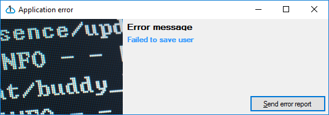
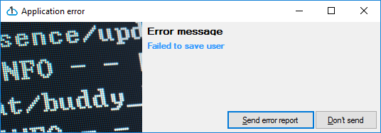
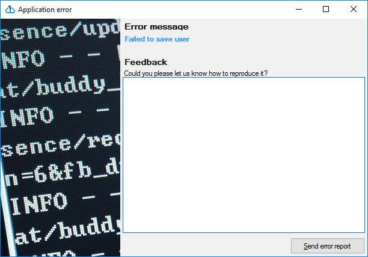
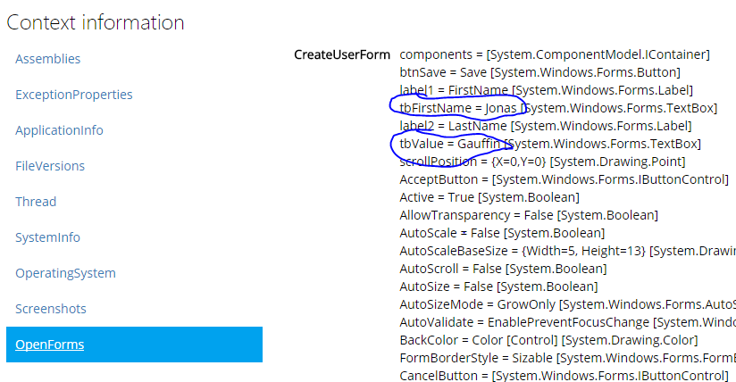

WinForms client library
==========================

The WinForms client library can help you display error pages and collect information about the open forms.

## Error pages

An error page is displayed when an exception is detected. It looks like this per default:



You configure it by using the following properties:

```csharp
OneTrue.Configuration.UserInteraction.AskUserForDetails = true;
OneTrue.Configuration.UserInteraction.AskUserForPermission = true;
OneTrue.Configuration.UserInteraction.AskForEmailAddress = true;
```

Examples:







## Context information

WinForms have to built in context collections

### OpenForms

OneTrueError collects information from all open forms using reflection. 

The information includes all controls and their configuration (position, content, visibility etc)



### Screenshots

Screnshots can be activated by one of the following configuration lines:

```csharp
//only of the active form
OneTrue.Configuration.TakeScreenshotOfActiveFormOnly();

// of all forms            
OneTrue.Configuration.TakeScreenshots();
```

The context collection will be shown as:


