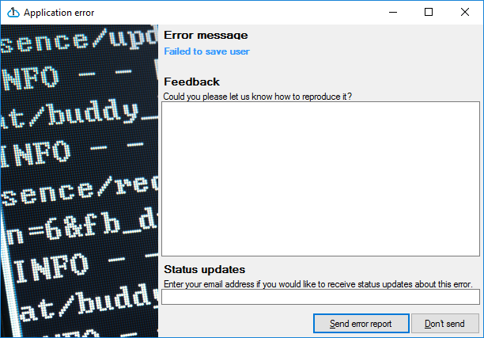

WinForms configuration
======================

Install the nuget package called `coderr.client.winforms`, if you haven't already.

Next, you need to tell the Coderr library what server it should upload all error reports to.

Please add the following code in your `Program.cs` (first in `Main()`).

```csharp
var url = new Uri("http://yourServer/coderr/");
Err.Configuration.Credentials(url, 
                              "yourAppKey", 
                              "yourSharedSecret");
Err.Configuration.CatchWinFormsExceptions();
```

Once configured, start your application and try manually to report an exception.

You can for example add the following code somewhere and then invoke your application:


```csharp
public void YourButton_Click()
{
    try
    {
        throw new Exception("Oooop");
    }
    catch (Exception ex)
    {
        _logger.Error("Testing Coderr", ex);
    }
}
```

The error should appear in the Coderr server shortly after being reported.

## More information

Did you know that Coderr can also take screenshots of your application forms? 

Or display error pages like the one below?



If you want more information, read the [client documentation](index.md) or on error reporting [report errors manually](../../gettingstarted.md)
