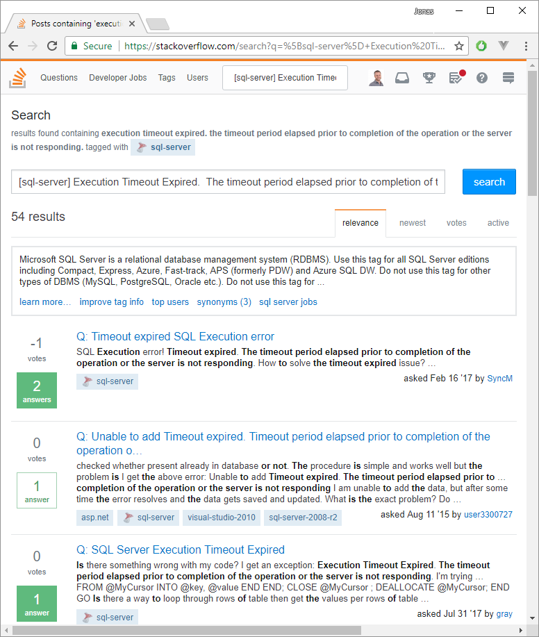

Tags
====

Tags allow you to categorize errors and to more easily find solutions at StackOverflow.com

To attach tags to an incident you can to the following:

```csharp
try
{
    //some stuff that generates an exception
}
catch (Exception ex)
{
    Err.Report(ex, new { ErrTags = "important,backend" });

    // alternative:
    // Err.Report(ex, new { ErrTags = new[] { "important", "backend" }});
}
```
## Add a tag to every report

You might also want to add which contains the server name. This can be easily done by using a [custom context provider](extending/contextprovider.md).

```csharp
public class ServerNameProvider : IContextInfoProvider
{
    public string Name => "ServerName";

    public ContextCollectionDTO Collect(IErrorReporterContext context)
    {
        var properties = new Dictionary<string, string>();
        properties.Add("ErrTags", Environment.MachineName);

        return new ContextCollectionDTO(Name, properties);
    }
}
```

The .NET Standard version of the interface is named `IContextCollectionProvider` instead of `IContextInfoProvider`.

To activate it the provider

```csharp
Err.Configuration.ContextProviders.Add(new ServerNameProvider());
```

## Finding incidents using tags

Once you have added tags you can use them to find specific incidents in the search interface:


## StackOverflow.com

We automatically identify common StackOverflow.com tags when we analyze exceptions.



When you click on one of the tags in the UI, we do a search for questions using the exception message and the clicked tag.


You can
also add your own tags by adding a special property to any context collection named "ErrTags":

```csharp
try
{
    //some stuff that generates an exception
}
catch (Exception ex)
{
    Err.Report(ex, new { ErrTags = "important,backend" });

    // alternative:
    // Err.Report(ex, new { ErrTags = new[]{"important","backend"} });
}
```

**Result:**


