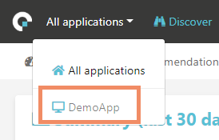
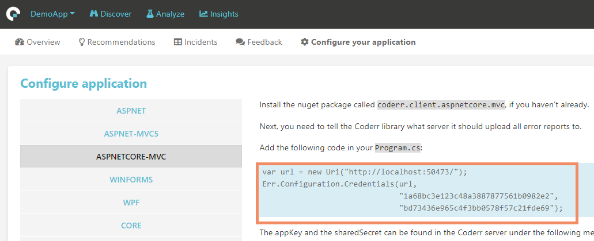
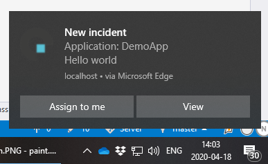
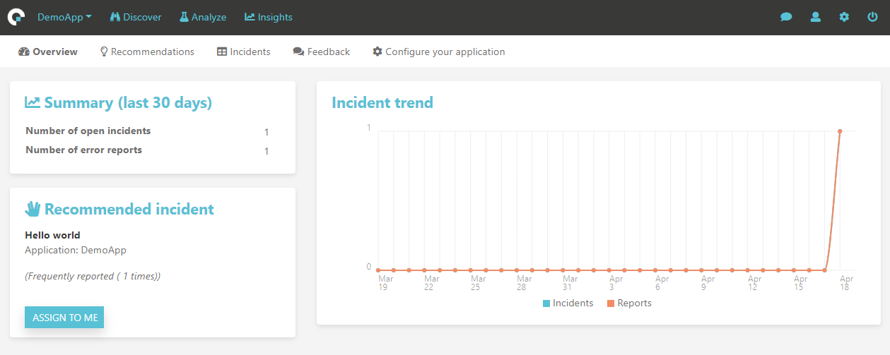
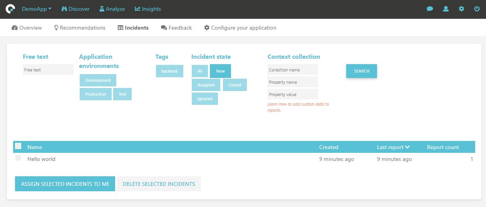
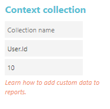
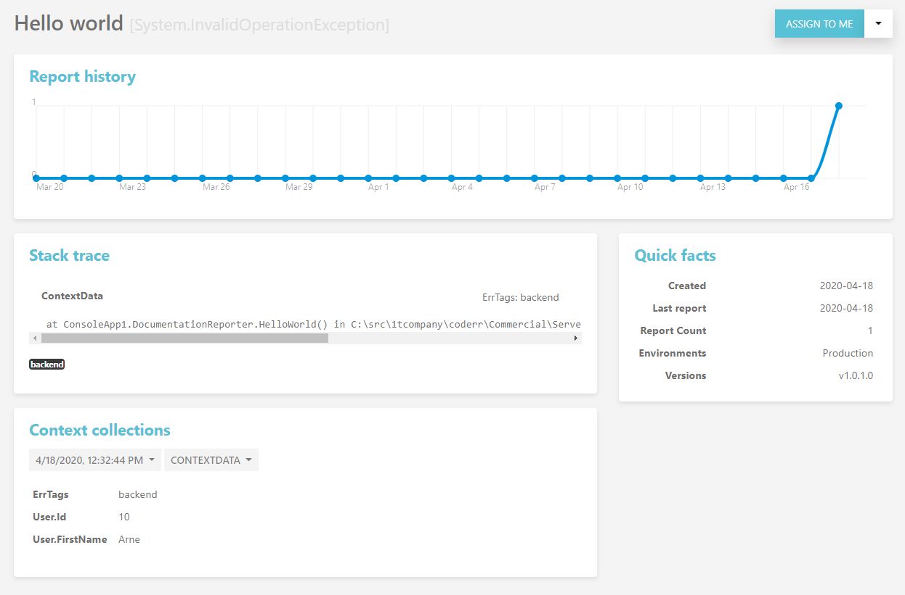
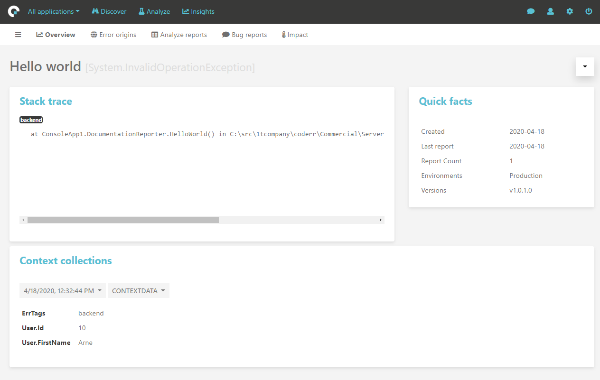
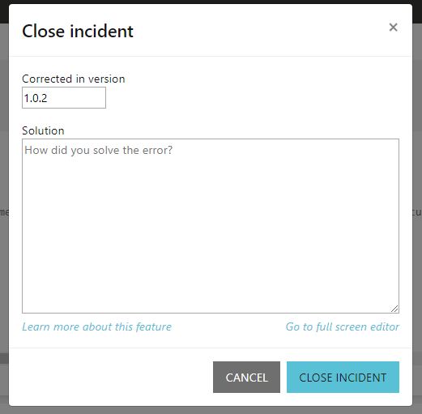

Getting started
===============

This guide is intended for first time users to get Coderr up and running with the most common features.

# Coderr Server

The Coderr server is used to analyze error reports and to correct errors. 

Select the [edition](https://coderr.io/try) that fits your requirements.


# Configuring your application

Install one of our nuget packages in your application.
The available packages are [listed here](../client/). 

An `appKey` and a `sharedSecret` is required to configure the the package. They are obtained from the server. Use a web browser and visit your Coderr Server. Lets use the default application, DemoApp, to report the first errors.

In the top menu, use the drop down list and select "DemoApp".



Next, click on "Configure your application" in the sub menu.


You will now see the configuration page which contains copy/paste instructions.



Select the .NET library that you are using in your application and then copy the marked code into your application. 

Coderr is now ready to report errors.

Each automation library requires one or two additional lines for the automatic error detection. It's typically something in line with `Coderr.Configuration.CatchMvcExceptions()`. The readme file included in the nuget package contains more information.

# Reporting the first error

To make sure that everything works, let's do a quick test. Paste the following code into the starting point (like Main in `Program.cs`).

```csharp
try
{
    throw new InvalidOperationException("Hello world");
}
catch (Exception ex)
{
    Err.Report(ex, new { ErrTags = "backend", User = new { Id = 10, FirstName = "Arne" }});
}
```

Congratulations. You have now reported an error. 

The second parameter is used to attach context information to the error. You will see the result later in the article.

If you have turned on browser notifications, you will se the following notification in Windows:



If not, visit your Coderr server. 

* [Turn on browser notifications](../features/incidents/notifications/)

# Finding the first error

It's time to see how the reported error looks like in Coderr.

Visit the Coderr Server web. The first page should now contain a reported error:



Coderr (commercial editions) will always recommend the most severe error. You can [customize](../features/recommendations/) how Coderr should prioritize errors.

## Search

The search feature allows you to quickly find the next error to solve.



The following search options are available:

* _**Free text**_ searches through the entire error reports after the given information.
* _**[Application environments](../features/environments)**_ allows you to find errors that exists in a specific environment (like production).
* _**[Tags](../features/incidents/tagging)**_ are used to categorize errors to allow developers to correct a specific type of error (depending on expertize).
* _**Incident state**_ can be used to search through other than new incidents.
* _**[Context collections](../features/incidents/context-collections)**_ are telemetry data, either collected automatically by Coderr, or supplied by you.

### Finding a specific user

Since we included user information in the error report, 

```csharp
Err.Report(ex, new { ErrTags = "backend", User = new { Id = 10, FirstName = "Arne" }});
```

.. we could have searched for that specific user:



Attaching and searching context data is a powerful way of managing errors. 

[Learn more context collections](../features/incidents/context-collections/)

# Correcting an error

Once you have found an error to work with, click on it to see more details.



This view is only used to decide which errors to work with.

The graph shows how frequently Coderr have received error reports for this incident.

## Quick facts

Quick facts to the right in the right in the screenshot.

* When the error was first detected by Coderr.
* When the most recent report was recieved.
* That the error only exists in production.
* That we have only received reports for v1.0.1 of the application.

Coderr automatically include which application version that the error was reported for, which environment (in this case "Production") and the tag, "backend", that we attached to the error report. 

## Features used when reporting

The following features were used when reporting the error.

* [Tags](../features/incidents/tagging/) 
* [Environment tracking](../features/incidents/environments/)
* [Custom context data](../features/incidents/context-collections#Custom)

# Solving the first error

Once you have decided which error you want to work with, click on the "Assign to me" button top right.

You are now in the analyze view which is designed to make it easy to accuratly and efficiently correct errors.



With analyze, you can:

* [View geographic report origins](../analyze/)
* [Browser error reports]()
* [Read bug reports from users](../features/bug-reports/)
* [Analyze business impact](../features/partitions/)

The context data ("Context collections") makes correcting bugs in production as easy as in development environments. No need to read bug reports from users or trying to find the relevant information in log files. Everything have been collected and packages for you.

## Close incident

Once you have corrected the error, click the "Close incident" button.



By entering a version number, Coderr will automatically ignore all error reports for the same error if the reported version is less or equal with the specified version. That way, there is no need to check if reported errors already have been corrected.

Learn more about [closing incidents](../features/incidents/close)

# Before going to production

Read this section carefully to configure Coderr correctly.

## Disabling Coderr's internal errors

When getting started with Coderr, it makes sense to allow Coderr to throw exceptions if the configuration is invalid or if reports can't be uploaded to the Coderr Server.

Once everything is OK, Coderr should not interfere with your application. Thus, you need to disable Coderr's own ability to throw exceptions.

```csharp
Err.Configuration.ThrowExceptions = false;
```

# Where to go next

If you are using our commercial editions you might want to read about [recommendations](../features/discover/recommendations/) or [Insights](../features/insights).

Don't hesitate to [email us](mailto:help@coderr.io) if you need help. Our [Guides and support](https://coderr.io/guides-and-support/) is otherwise a perfect place to visit next.